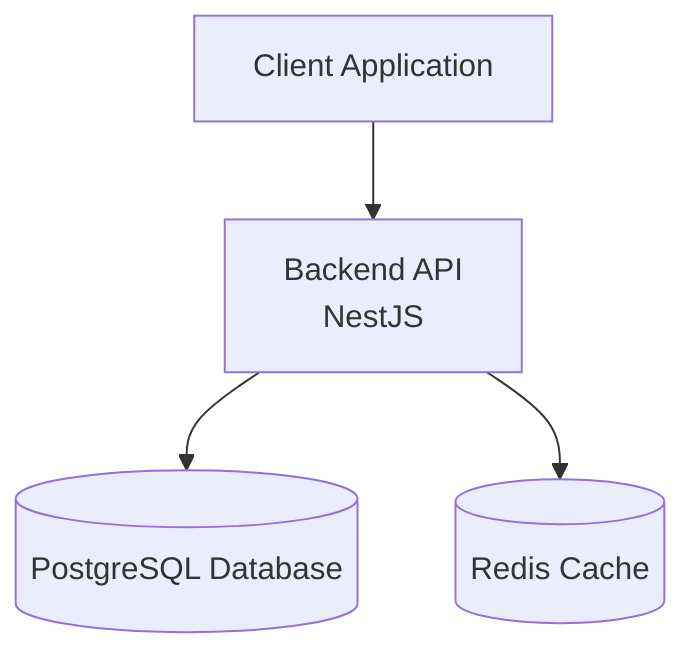

# 📚 Knowledge Hub API


Production-style **REST API for managing technical knowledge resources** built with **NestJS, TypeScript, PostgreSQL, Prisma and Redis** following modern backend architecture patterns.

The goal of this project is to simulate **a real backend architecture used in production systems** including authentication security patterns, caching strategies, database modeling and automated testing.

---

# 🧠 Project Idea

Developers often save resources like:

- documentation
- tutorials
- articles
- tools
- guides

but these resources are usually **scattered across bookmarks, notes and different platforms**.

Knowledge Hub solves this by providing a backend API where users can:

- store technical resources
- organize them with categories
- mark favorites
- track learning resources
- retrieve them efficiently with caching

---

# 🏗 System Architecture



The architecture demonstrates a **typical backend production stack**:

- API layer (NestJS)
- relational database (PostgreSQL)
- caching layer (Redis)

---

# 🚀 Features

## Authentication & Security

- User registration
- User login
- JWT access tokens
- Refresh token rotation
- Secure refresh token hashing
- Session tracking per device
- Logout from single session
- Logout from all sessions
- Role-based authorization (RBAC)
- HTTP-only refresh token cookies

---

## Resource Management

Users can store and manage technical resources.

- Create resource
- Update resource
- Delete resource
- List resources
- Pagination support
- Search resources
- Filter by category

Example resource:

```
Title: NestJS Documentation
URL: https://docs.nestjs.com
Notes: official documentation
```

---

## Categories

Resources can be organized using categories.

Example categories:

```
Backend
Databases
DevOps
Architecture
Testing
```

Users can create and manage their own categories.

---

## Favorites

Users can mark resources as favorites to easily retrieve important content.

---

## Performance Optimization

The API implements **Redis caching using the Cache-Aside pattern**.

Cached endpoints include:

- resource list queries
- paginated results

Cache invalidation occurs automatically when:

- resources are created
- resources are updated
- resources are deleted

Benefits:

- faster response times
- reduced database load
- scalable architecture

---

# 📡 API Endpoints

### Authentication

| Method | Endpoint | Description |
|------|------|------|
| POST | `/auth/register` | Register user |
| POST | `/auth/login` | Login user |
| POST | `/auth/refresh` | Refresh access token |
| POST | `/auth/logout` | Logout session |
| POST | `/auth/logout-all` | Logout all sessions |
| GET | `/auth/sessions` | List active sessions |

---

### Resources

| Method | Endpoint | Description |
|------|------|------|
| POST | `/resources` | Create resource |
| GET | `/resources` | List resources |
| GET | `/resources/:id` | Get resource |
| PATCH | `/resources/:id` | Update resource |
| DELETE | `/resources/:id` | Delete resource |

Supports:

- pagination
- search
- category filtering

Example:

```
GET /resources?page=1&limit=10&search=nestjs
```

---

### Categories

| Method | Endpoint | Description |
|------|------|------|
| POST | `/categories` | Create category |
| GET | `/categories` | List categories |
| PATCH | `/categories/:id` | Update category |
| DELETE | `/categories/:id` | Delete category |

---

### Favorites

| Method | Endpoint | Description |
|------|------|------|
| POST | `/favorites/:resourceId` | Add favorite |
| DELETE | `/favorites/:resourceId` | Remove favorite |
| GET | `/favorites` | List favorite resources |

---

# ⚡ Redis Caching Strategy

This project uses the **Cache-Aside pattern**.

Flow:

```
Request → Redis Cache → Database
```

Process:

1️⃣ API checks Redis  
2️⃣ If cache exists → return cached data  
3️⃣ If cache miss → query database  
4️⃣ Store result in Redis with TTL  

Cache invalidation occurs after:

- resource creation
- resource update
- resource deletion

---

# 🐳 Docker Setup

The project supports **Docker Compose** to run the full stack locally.

Services:

- NestJS API
- PostgreSQL database
- Redis cache

Run locally:

```bash
docker compose up --build
```

Stop services:

```bash
docker compose down
```

---

# 📁 Project Structure

```
src/

auth/
resources/
categories/
favorites/
users/

prisma/
redis/

test/

main.ts
app.module.ts
```

Architecture layers:

```
Controllers → HTTP layer
Services → Business logic
Prisma → Database layer
Redis → Caching layer
Guards → Authorization
```

---

# 🛠 Tech Stack

Backend

- NestJS
- TypeScript

Database

- PostgreSQL
- Prisma ORM

Caching

- Redis

Authentication

- JWT
- Refresh Token Rotation

Infrastructure

- Docker
- Docker Compose

Testing

- Jest
- Supertest
- E2E testing

Security

- HTTP-only cookies
- hashed refresh tokens
- role-based access control

---

# 🔐 Environment Variables

Example `.env`

```
DATABASE_URL=
DATABASE_URL_TEST=

JWT_ACCESS_SECRET=
JWT_REFRESH_SECRET=

JWT_ACCESS_EXPIRES=15m
JWT_REFRESH_EXPIRES=7d

REDIS_HOST=localhost
REDIS_PORT=6379
```

---

# 🧪 Testing

The project includes **E2E tests with database isolation**.

Testing tools:

- Jest
- Supertest

Tests run against a **separate PostgreSQL test database**.

Run tests:

```
npm run test:e2e
```

---

# 🧠 What This Project Demonstrates

This backend demonstrates **real-world backend engineering concepts** used in production:

- secure authentication strategies
- refresh token rotation
- session management
- redis caching
- database modeling
- role-based authorization
- pagination and filtering
- dockerized infrastructure
- automated testing

It simulates the architecture of a **modern developer knowledge management platform backend**.

---

# ⚙ Future Improvements

Possible production extensions:

- OpenAPI / Swagger documentation
- CI/CD pipelines
- distributed caching
- monitoring (Prometheus / Grafana)
- background jobs (queues)
- AI-powered resource summarization
- API gateway integration

---

# 👨‍💻 Author

Sebastian Olarte  
Backend Developer