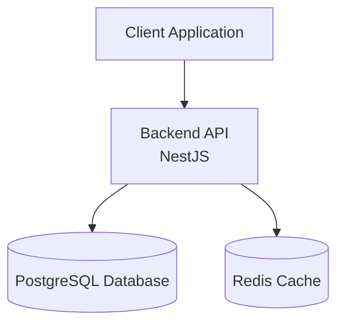
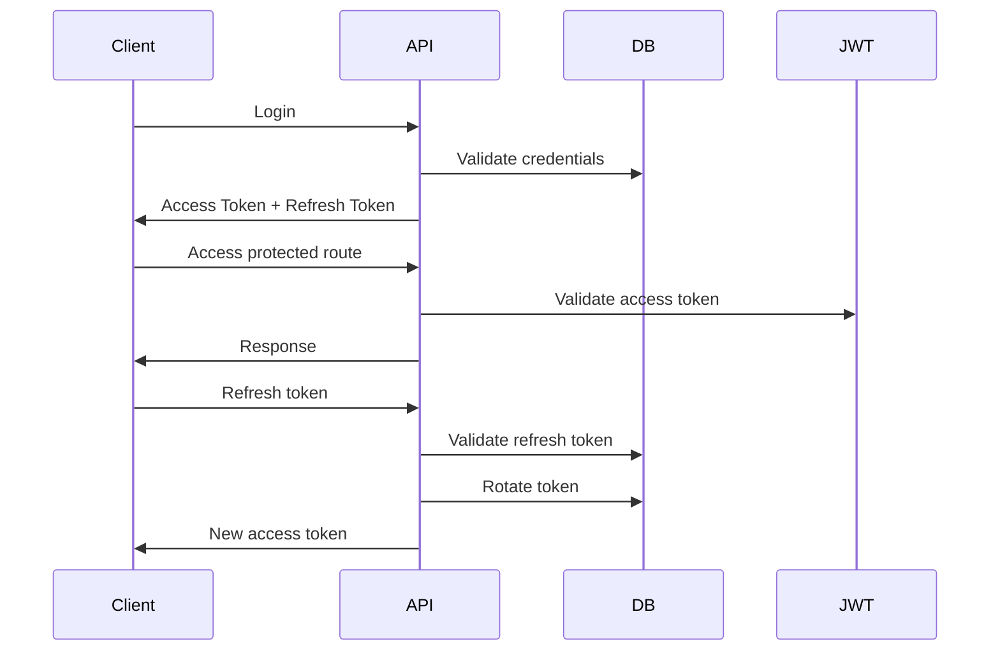

# 📚 Knowledge Hub API


Production-style **REST API for managing developer knowledge resources** built with **NestJS, TypeScript, PostgreSQL, Prisma and Redis**.

This project demonstrates **real backend architecture practices used in modern production systems** including authentication security patterns, Redis caching, database modeling, rate limiting, automated testing and API documentation.

---

# 🧠 Project Idea

Developers constantly save resources like:

- documentation
- tutorials
- articles
- technical guides
- tools

These resources often end up scattered across bookmarks or notes.

**Knowledge Hub API** allows developers to:

- store technical resources
- organize them with categories
- mark favorites
- search resources
- access them efficiently using caching

---

# 🏗 System Architecture



Architecture layers:

```
Controllers → HTTP layer
Services → Business logic
Prisma → Database layer
Redis → Caching layer
Guards → Authorization
```

---

# 🚀 Features

## Authentication & Security

- User registration
- User login
- JWT access tokens
- Refresh token rotation
- Secure refresh token hashing
- Session tracking per device
- Logout single session
- Logout all sessions
- Role-based authorization (RBAC)
- HTTP-only refresh token cookies

---

## Resource Management

Users can store and manage technical resources.

Features:

- Create resource
- Update resource
- Delete resource
- List resources
- Pagination
- Search
- Filter by category

Example resource:

```
Title: NestJS Documentation
URL: https://docs.nestjs.com
Notes: Official NestJS documentation
```

---

## Categories

Resources can be organized with categories.

Example categories:

```
Backend
Databases
DevOps
Architecture
Testing
```

Each user manages their own categories.

---

## Favorites

Users can mark resources as favorites to access important content quickly.

---

# ⚡ Redis Caching Strategy

The API implements the **Cache-Aside pattern**.

Flow:

```
Client → Redis → PostgreSQL
```

Process:

1️⃣ API checks Redis  
2️⃣ Cache hit → return cached data  
3️⃣ Cache miss → query database  
4️⃣ Store result in Redis with TTL  

Cache invalidation occurs when:

- resources are created
- resources are updated
- resources are deleted

Benefits:

- reduced database load
- faster responses
- scalable backend architecture

---

# 🔐 Authentication Flow

The system uses **Access Token + Refresh Token rotation**.



Security benefits:

- prevents refresh token reuse
- allows session-level revocation
- improves token lifecycle security

---

# 📡 API Endpoints

## Authentication

| Method | Endpoint | Description |
|------|------|------|
| POST | `/auth/register` | Register user |
| POST | `/auth/login` | Login user |
| POST | `/auth/refresh` | Refresh access token |
| POST | `/auth/logout` | Logout session |
| POST | `/auth/logout-all` | Logout all sessions |
| GET | `/auth/sessions` | List active sessions |

---

## Resources

| Method | Endpoint | Description |
|------|------|------|
| POST | `/resources` | Create resource |
| GET | `/resources` | List resources |
| GET | `/resources/:id` | Get resource |
| PATCH | `/resources/:id` | Update resource |
| DELETE | `/resources/:id` | Delete resource |

Supports:

```
pagination
search
category filtering
```

Example:

```
GET /resources?page=1&limit=10&search=nestjs
```

---

## Categories

| Method | Endpoint | Description |
|------|------|------|
| POST | `/categories` | Create category |
| GET | `/categories` | List categories |
| DELETE | `/categories/:id` | Delete category |

---

## Favorites

| Method | Endpoint | Description |
|------|------|------|
| POST | `/favorites/:resourceId` | Add favorite |
| DELETE | `/favorites/:resourceId` | Remove favorite |
| GET | `/favorites` | List favorite resources |

---

# 📖 API Documentation

The project includes **interactive API documentation using Swagger**.

Run the server and open:

```
http://localhost:4000/docs
```

Swagger allows you to:

- explore endpoints
- test requests
- authenticate using JWT
- inspect request/response schemas

---

# 🐳 Docker Setup

The project can run with **Docker Compose**.

Services:

- NestJS API
- PostgreSQL
- Redis

Run locally:

```
docker compose up --build
```

Stop services:

```
docker compose down
```

---

# 📁 Project Structure

```
src/

auth/
resources/
categories/
favorites/
users/

prisma/
redis/

test/

main.ts
app.module.ts
```

Architecture layers:

```
Controllers → HTTP layer
Services → Business logic
Prisma → Database access
Redis → Caching layer
Guards → Authorization
```

---

# 🛠 Tech Stack

Backend

- NestJS
- TypeScript

Database

- PostgreSQL
- Prisma ORM

Caching

- Redis

Authentication

- JWT
- Refresh Token Rotation

Infrastructure

- Docker
- Docker Compose

Testing

- Jest
- Supertest
- E2E tests

Documentation

- Swagger (OpenAPI)

Security

- HTTP-only cookies
- hashed refresh tokens
- role-based access control

---

# 🔐 Environment Variables

Example `.env`

```
DATABASE_URL=
DATABASE_URL_TEST=

JWT_ACCESS_SECRET=
JWT_REFRESH_SECRET=

JWT_ACCESS_EXPIRES=15m
JWT_REFRESH_EXPIRES=7d

REDIS_HOST=localhost
REDIS_PORT=6379
```

---

# 🧪 Testing

The project includes **E2E tests with database isolation**.

Testing tools:

- Jest
- Supertest

Tests run against a **separate PostgreSQL test database**.

Run tests:

```
npm run test:e2e
```

---

# 🧠 What This Project Demonstrates

This backend demonstrates **modern backend engineering practices**:

- secure authentication
- refresh token rotation
- session management
- redis caching
- database modeling
- role-based authorization
- pagination and filtering
- dockerized infrastructure
- automated testing
- API documentation

It simulates the architecture of a **modern developer knowledge management platform backend**.

---

# ⚙ Future Improvements

Potential production improvements:

- CI/CD pipelines
- monitoring (Prometheus / Grafana)
- background workers
- distributed caching
- AI-powered resource summarization
- API gateway integration

---

# 👨‍💻 Author

Sebastian Olarte  
Backend Developer