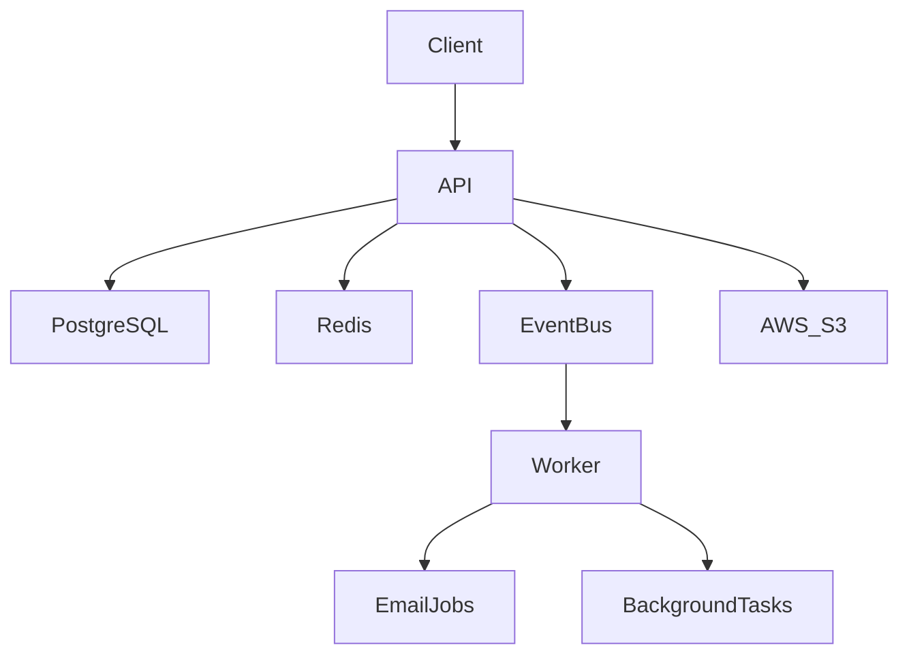
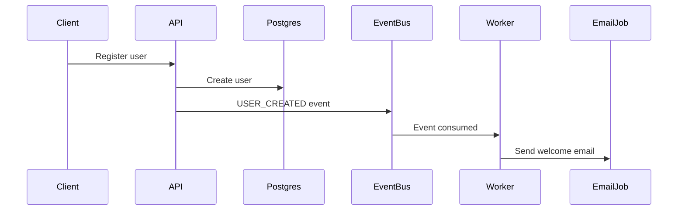
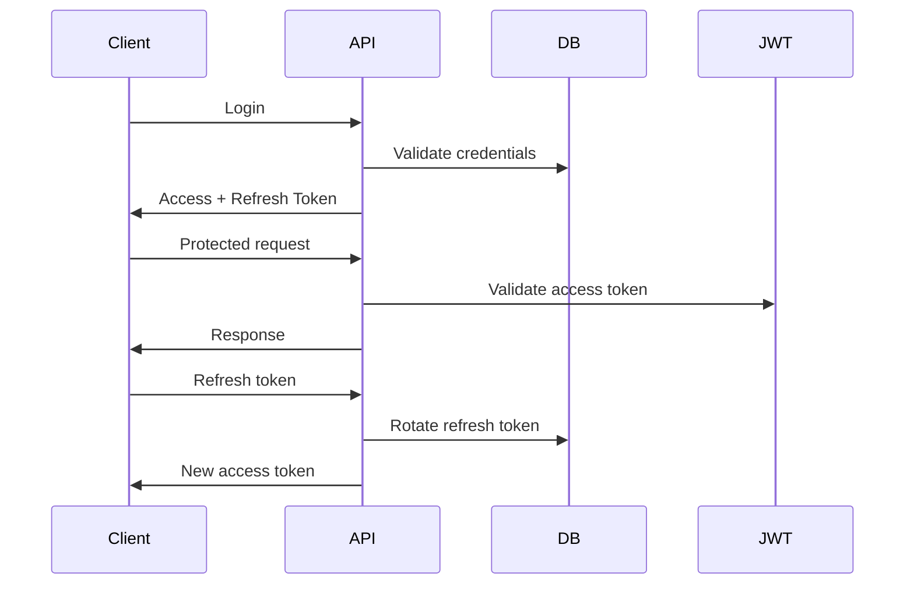

# 📚 Knowledge Hub – Backend Architecture


Production-style **event-driven backend system** for managing developer knowledge resources built with **NestJS, PostgreSQL, Redis, BullMQ and AWS S3**.

This project demonstrates **modern backend architecture patterns used in real production systems**, including:

- event-driven processing
- background workers
- distributed caching
- secure authentication flows
- scalable job queues
- cloud infrastructure integration

---

# 🧠 Project Idea

Developers constantly save resources such as:

- documentation
- tutorials
- technical articles
- tools
- architecture guides

These resources often become **fragmented across bookmarks, notes and different platforms**.

Knowledge Hub provides a backend system where developers can:

- store technical resources
- categorize them
- search and filter resources
- mark favorites
- upload files
- access cached results efficiently

---

# 🏗 System Architecture

The system follows a **modular event-driven architecture**.



---

# ⚙ Architecture Overview

The system is composed of **two main services**.

```
knowledge-hub
├ api
│   NestJS REST API
│
└ worker
    background job processor
```

---

# 🧩 API Service

Responsibilities:

```
authentication
resource management
category management
favorites
file uploads
event publishing
```

Technology:

```
NestJS
Prisma
PostgreSQL
Redis
AWS S3
```

---

# ⚙ Worker Service

Background workers process **asynchronous jobs** from Redis queues.

Examples:

```
send welcome emails
process background tasks
retry failed jobs
handle event-driven processes
```

Technology:

```
NestJS
BullMQ
Redis
```

---

# ⚡ Event-Driven Architecture

The system uses an **Event Bus implemented with Redis + BullMQ**.

Instead of calling services directly, the API publishes **domain events**.

Example:

```
USER_CREATED
RESOURCE_CREATED
FAVORITE_ADDED
```

Flow:



Benefits:

- decoupled services
- scalable background processing
- improved system reliability
- easier feature expansion

---

# 🔄 Job Queue Processing

Queues are implemented using **BullMQ**.

Example job flow:

```
API → Queue → Worker → Processor
```

Features implemented:

```
job retries
exponential backoff
dead letter queue (DLQ)
background job processing
```

---

# 📦 Dead Letter Queue (DLQ)

Failed jobs are automatically moved to a **Dead Letter Queue** after repeated failures.

Example:

```
job fails 3 times
      ↓
move to DLQ
      ↓
manual inspection
```

Benefits:

```
prevents infinite retries
improves reliability
helps debugging failures
```

---

# ⚡ Redis Usage

Redis is used for multiple purposes:

```
API caching
event bus
background job queues
rate limiting
token blacklisting
```

Example caching flow:

```
Client → Redis → PostgreSQL
```

Cache-Aside strategy:

1️⃣ check Redis  
2️⃣ cache hit → return  
3️⃣ cache miss → query database  
4️⃣ store result in Redis

---

# 🔐 Authentication & Security

Authentication system implements **secure token lifecycle management**.

Features:

```
JWT access tokens
refresh token rotation
hashed refresh tokens
session tracking
logout per session
logout all sessions
role-based access control
HTTP-only cookies
```

Authentication flow:



---

# 📁 Resource Management

Users can store developer resources.

Example resource:

```
Title: NestJS Documentation
URL: https://docs.nestjs.com
Notes: Official NestJS docs
```

Features:

```
create resources
update resources
delete resources
search resources
pagination
category filtering
```

---

# 📂 Categories

Resources can be organized using categories.

Example:

```
Backend
Databases
DevOps
Architecture
Testing
```

Each user manages their own categories.

---

# ⭐ Favorites

Users can mark resources as favorites for quick access.

---

# ☁ File Uploads

Files can be uploaded and stored using **AWS S3**.

Example use cases:

```
PDF guides
architecture diagrams
technical notes
```

Uploaded files are stored securely in cloud storage.

---

# 📡 API Endpoints

### Authentication

```
POST   /auth/register
POST   /auth/login
POST   /auth/refresh
POST   /auth/logout
POST   /auth/logout-all
GET    /auth/sessions
```

---

### Resources

```
POST   /resources
GET    /resources
GET    /resources/:id
PATCH  /resources/:id
DELETE /resources/:id
```

Supports:

```
pagination
search
category filtering
```

Example:

```
GET /resources?page=1&limit=10&search=nestjs
```

---

### Categories

```
POST   /categories
GET    /categories
DELETE /categories/:id
```

---

### Favorites

```
POST   /favorites/:resourceId
DELETE /favorites/:resourceId
GET    /favorites
```

---

# 📖 API Documentation

Interactive API documentation powered by **Swagger**.

```
Live API
https://knowledge-hub-api-kuy2.onrender.com

API Documentation
https://knowledge-hub-api-kuy2.onrender.com/docs
```

Swagger allows you to:

- explore endpoints
- test requests
- authenticate using JWT
- inspect request/response schemas

---

# 🐳 Docker Setup

The project can run locally using **Docker Compose**.

Services:

- NestJS API
- PostgreSQL
- Redis

Run locally:

```
docker compose up --build
```

Stop services:

```
docker compose down
```

---

# 📁 Project Structure

```
knowledge-hub

├ api
│   src/
│   prisma/
│
└ worker
    src/
```

Architecture layers:

```
Controllers → HTTP layer
Services → Business logic
Prisma → Database layer
Redis → Cache & Event Bus
Queues → Background processing
Workers → Async tasks
```

---

# 🛠 Tech Stack

Backend

```
NestJS
TypeScript
```

Database

```
PostgreSQL
Prisma ORM
```

Infrastructure

```
Redis
BullMQ
AWS S3
Docker
Render
```

Security

```
JWT authentication
Refresh token rotation
Session management
Role-based access control
```

Testing

```
Jest
Supertest
E2E tests
```

Documentation

```
Swagger (OpenAPI)
```

---

# 🧪 Testing

The project includes **E2E tests with database isolation**.

Testing tools:

```
Jest
Supertest
```

Run tests:

```
npm run test:e2e
```

---

# 🧠 What This Project Demonstrates

This backend demonstrates **modern backend engineering practices**:

- event-driven architecture
- asynchronous workers
- Redis caching
- job queues with retries
- dead letter queues
- secure authentication
- scalable infrastructure
- cloud storage integration
- containerized deployment

---

# ⚙ Future Improvements

Potential production improvements:

```
CI/CD pipelines
monitoring (Prometheus / Grafana)
distributed tracing
microservices architecture
AI-powered resource summarization
API gateway integration
```

---

# 👨‍💻 Author

Sebastian Olarte  
Backend Developer
