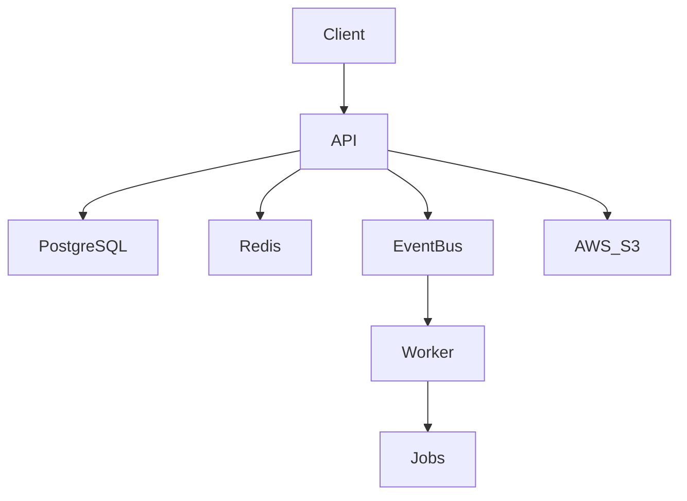
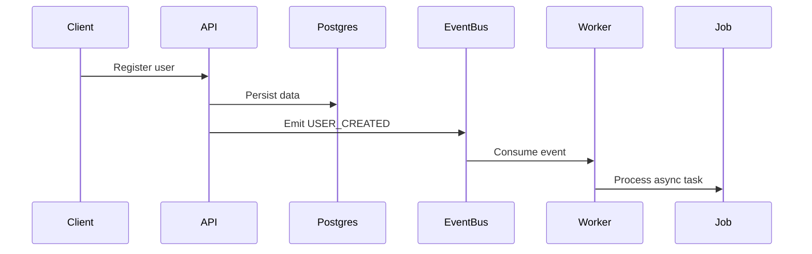

# 📚 Knowledge Hub – Scalable Backend Architecture


Production-ready **event-driven backend system** designed to manage developer knowledge resources at scale.

Built with **NestJS, PostgreSQL, Redis, BullMQ and AWS S3**, this project reflects **real-world backend architecture patterns used in modern scalable systems**.

---

# 🧠 Why This Project

Developers constantly save resources:

* documentation
* tutorials
* articles
* tools
* architecture references

These often become **fragmented across multiple platforms**.

👉 Knowledge Hub centralizes them into a **structured, scalable backend system** with:

* efficient querying
* caching
* asynchronous processing
* secure authentication

---

# 🏗 Architecture Overview



---

# ⚙ System Design

```
knowledge-hub
├ api      → REST API (core business logic)
└ worker   → background job processor
```

---

# 🧩 API Service

Handles all synchronous operations:

* authentication & session management
* resource CRUD
* categories & favorites
* file uploads
* event publishing

### Tech

```
NestJS
Prisma ORM
PostgreSQL
Redis (cache + event bus)
AWS S3
```

---

# ⚙ Worker Service

Processes asynchronous jobs using queues.

### Responsibilities

* email processing
* background tasks
* retry logic
* event consumption

### Tech

```
NestJS
BullMQ
Redis
```

---

# ⚡ Event-Driven Architecture

Instead of tightly coupling services, the system uses **domain events**.

### Example events

```
USER_CREATED
RESOURCE_CREATED
FAVORITE_ADDED
```

### Flow



### Benefits

* loose coupling
* scalability
* easier feature extension
* fault isolation

---

# 🔄 Queue Processing (BullMQ)

Asynchronous processing is handled through **job queues**.

### Features implemented

```
retry strategy
exponential backoff
dead letter queue (DLQ)
job isolation
```

---

# 📦 Dead Letter Queue (DLQ)

Failed jobs are automatically redirected.

```
job fails repeatedly
      ↓
moved to DLQ
      ↓
manual inspection
```

### Why it matters

* avoids infinite retries
* improves observability
* production-grade reliability

---

# ⚡ Redis Usage (Multi-Purpose)

Redis plays a central role:

```
caching layer
event bus
job queues
rate limiting
token/session handling
```

### Cache Strategy

Cache-Aside pattern:

1. check cache
2. fallback to DB
3. update cache

---

# 🔐 Authentication & Security

Implements a **robust token lifecycle system**.

### Features

```
JWT access tokens
refresh token rotation
hashed refresh tokens
session tracking
logout per session
logout all sessions
role-based access control (RBAC)
HTTP-only cookies
```

### Advanced Security

* refresh token reuse detection

---

# 📁 Resource Management

Users can store and organize developer resources.

Example:

```
NestJS Docs
https://docs.nestjs.com
```

### Features

```
CRUD operations
pagination
search
filtering
```

---

# 📂 Categories

User-specific organization system:

```
Backend
DevOps
Databases
Architecture
```

---

# ⭐ Favorites

Quick access to important resources.

---

# ☁ File Uploads (AWS S3)

Supports uploading files:

```
PDFs
notes
diagrams
```

Stored securely in cloud storage.

---

# 📡 API Endpoints

### Auth

```
POST /auth/register
POST /auth/login
POST /auth/refresh
POST /auth/logout
POST /auth/logout-all
GET  /auth/sessions
```

---

### Resources

```
POST   /resources
GET    /resources
GET    /resources/:id
PATCH  /resources/:id
DELETE /resources/:id
```

---

### Categories

```
POST   /categories
GET    /categories
DELETE /categories/:id
```

---

### Favorites

```
POST   /favorites/:resourceId
DELETE /favorites/:resourceId
GET    /favorites
```

---

# 📖 API Docs (Swagger)

```
https://knowledge-hub-api-kuy2.onrender.com/docs
```

---

# 🐳 Docker Setup

```bash
docker compose up --build
docker compose down
```

---

# 📁 Project Structure

```
Controllers → HTTP layer
Services    → business logic
Prisma      → database access
Redis       → cache + event bus
Queues      → async processing
Workers     → background jobs
```

---

# 🛠 Tech Stack

### Backend

```
NestJS
TypeScript
```

### Data

```
PostgreSQL
Prisma
Redis
```

### Infra

```
BullMQ
AWS S3
Docker
Render
```

### Testing

```
Jest
Supertest
E2E testing
```

---

# 🧪 Testing Strategy

Includes **end-to-end testing with isolation and mocking**.

### Highlights

* isolated test database
* Redis mocked
* BullMQ queues mocked
* clean DB per test

```bash
npm run test:e2e
```

---

# 🧠 What This Project Proves

This project demonstrates:

* event-driven backend design
* async processing with queues
* caching strategies
* secure auth flows
* scalable architecture
* real production patterns

---

# ⚙ Future Improvements

```
CI/CD pipelines
monitoring (Prometheus / Grafana)
distributed tracing
API Gateway
microservices split
AI-powered resource analysis
```

---

# 👨‍💻 Author

Sebastian Olarte
Backend Developer
